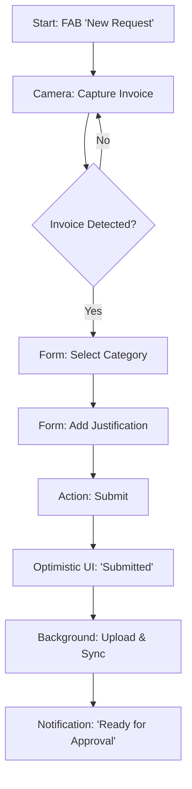
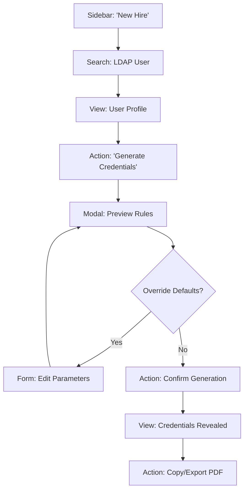
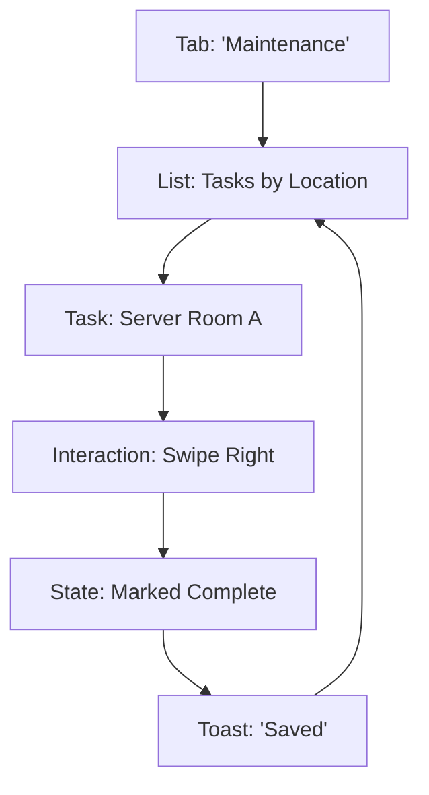

---
stepsCompleted:
  - 1
  - 2
  - 3
  - 4
  - 5
  - 6
  - 7
  - 8
  - 9
  - 10
  - 11
  - 12
  - 13
inputDocuments:
  - _bmad-output/planning-artifacts/prd.md
  - _bmad-output/project-context.md
  - docs/patterns.md
---

# UX Design Specification IT-Hub

**Author:** Haziq afendi
**Date:** 2026-01-30

---

<!-- UX design content will be appended sequentially through collaborative workflow steps -->

## Executive Summary

### Project Vision
IT-Hub centralizes core IT operations (LDAP, Credentials, Maintenance, Requests) into a unified internal SPA. It replaces spreadsheet dependency with a robust, audit-logged system that supports efficient desktop operations and on-the-go mobile workflows for maintenance and approvals.

### Target Users

1.  **IT Technicians (Primary Users):**
    *   **Context:** Handle day-to-day operations and internal requests.
    *   **Desktop Needs:** High-density interfaces for LDAP sync, complex credential generation, and export management.
    *   **Mobile Needs:** streamlined, touch-friendly checklists for performing Preventive Maintenance rounds without a laptop.
2.  **Head of IT / Admin (Oversight):**
    *   **Context:** Manages team priorities and approvals.
    *   **Mobile/Desktop Needs:** Quick visibility into status, easy approval workflows, and high-level dashboarding.

### Key Design Challenges

*   **Hybrid Device Context:** The application must flawlessly switch between a high-density "Control Center" feel on desktop (for bulk data, logs, and exports) and a "Field Utility" feel on mobile (for maintenance checklists and quick approvals).
*   **Critical Action Clarity:** Distinguishing between routine tasks and destructive/sensitive actions (like regenerating credentials or syncing LDAP) to prevent errors without slowing down expert users.
*   **Preventive Maintenance Experience:** Designing a PM workflow that offers enough detail for compliance but is simple enough to use comfortably on a phone while walking around server rooms or office floors.

### Design Opportunities

*   **Live "Pulse" Dashboard:** Leveraging Server-Sent Events (SSE) to show real-time activity (sync progress, new requests) so the team stays coordinated without refreshing.
*   **Mobile-Optimized Checklists:** Creating a satisfying, efficient interaction pattern for PM tasks on mobile (e.g., swipe-to-complete or large touch targets) to encourage timely compliance.

## Core User Experience

### Defining Experience
The core experience centers on **Rapid Request Fulfillment** and **Operational Transparency**. Since "Item Requesting" is the highest volume activity, the system acts as a "Service Portal" first and an "Admin Console" second. It connects needs (requests) to actions (fulfillment) with zero friction.

### Platform Strategy
*   **Web-First Hybrid:**
    *   **Desktop:** The "Command Center" for fulfillment (Technicians), managing complex tickets, syncing LDAP, and handling exports.
    *   **Mobile:** The "Field & Fast-Track" interface for submitting requests (uploading invoice photos from camera), performing maintenance rounds, and approving items on the go.

### Effortless Interactions
*   **"Snap & Submit" Requests:** Users (technicians/staff) should be able to snap a photo of an invoice on mobile and attach it to a request instantly.
*   **Status Transparency:** requestors never need to ask "where is my item?"—visual trackers show exact status (Received -> Approved -> Ordered -> Ready).
*   **Zero-Click Auditing:** Every state change (especially in requests and credentials) is automatically logged without user intervention.

### Critical Success Moments
*   **The "Submission Confidence":** When a user submits a request, they instantly receive confirmation and a clear "Next Step" indicator, eliminating anxiety about "black hole" inboxes.
*   **The "One-Tap" Approval:** Head of IT allows a request from a mobile notification with a single interaction, unblocking the team immediately.

### Experience Principles
1.  **Request-Centricity:** The inflow of work (requests) is prioritized in the UI, ensuring nothing gets missed.
2.  **Mobile Agility:** Detailed tasks (requests/maintenance) are fully optimized for mobile input (camera, touch).
3.  **Trust through Transparency:** Detailed logs and live status updates build trust between Requesters and IT.

## Desired Emotional Response

### Primary Emotional Goals
*   **Professional Confidence:** Technicians must feel absolute trust in the system's accuracy (credentials/sync) and stability.
*   **Low-Friction Relief:** Requesters (often non-technical) should feel a sense of relief that the process is simple and "taken care of" immediately after submission.

### Emotional Journey Mapping
*   **First Impression:** "Modern Capability." A clean, dark-mode interface that signals "this is a serious tool," distinguishing it from legacy enterprise software.
*   **During Action (Submission/Generation):** "Guided Security." The user feels handheld by the system to prevent errors (e.g., specific validation for credentials, auto-complete for requests).
*   **After Action:** "Reassurance & Closure." Immediate confirmation (Toasts/Notifications) and visible status changes ("Pending" -> "Approved") remove the need to follow up manually.

### Micro-Emotions
*   **Confidence vs. Confusion:** Prioritize **Confidence** in Credential Generation. Use "Reveal" buttons and clear copy (user/pass) to ensure zero ambiguity.
*   **Belonging vs. Isolation:** Foster **Belonging/Connection** through Live Updates. Seeing a request move to "Approved" in real-time makes the IT department feel responsive and present.

### Design Implications
*   **For Confidence:** Use specific, distinct iconography for different states (Syncing, Success, Error). Never use generic spinners for long; tell the user *what* is happening.
*   **For Relief:** Use "One-Thing-Per-Page" or progressive disclosure for Request forms. Don't show 50 optional fields; show the 3 required ones first.

### Emotional Design Principles
1.  **Never Leave them Guessing:** Every process must have a clear beginning, middle (progress), and end (confirmation).

## UX Pattern Analysis & Inspiration

### Inspiring Products Analysis
*   **Linear:** Admired for keyboard efficiency and high-density information layout without clutter.
*   **Vercel Dashboard:** Validated for professional dark mode aesthetics and clear representation of complex async states (deployments/logs).
*   **Expensify (Mobile):** The gold standard for "capture-and-forget" mobile workflows.

### Transferable UX Patterns
*   **Command Palette:** `Cmd+K` global search/action menu for power users to jump between sections or find users.
*   **Optimistic UI:** Immediate visual feedback on actions (Approve/Reject) to make the app feel instant, even if the server takes 200ms.
*   **Camera-First Mobile Actions:** Prioritizing image capture for requests on mobile devices.

### Anti-Patterns to Avoid
*   **Over-Pagination:** Avoid splitting related data across many pages; prefer infinite scroll or long pages for logs.
*   **Mystery Meat Navigation:** Avoid icon-only buttons without tooltips or labels in the sidebar.

## Design System Foundation

### 1.1 Design System Choice
**Shadcn/UI** (Radix Primitives + Tailwind CSS).

### Rationale for Selection
*   **Professional Aesthetic:** Out-of-the-box support for the clean, "Linear-like" dark mode required for IT confidence.
*   **Density Control:** Unlike Material UI (which defaults to spacious mobile-first), Shadcn/Tailwind allows trivial creation of "compact" desktop views alongside "touch-accessible" mobile views.
*   **Component Ownership:** "Copy-paste" architecture ensures the project owns its components, preventing external library breaking changes from stalling critical IT updates.

### Implementation Approach
*   **Icons:** `lucide-react` for consistent, technical iconography.
*   **Data Tables:** `TanStack Table` for sortable, filterable high-density lists (LDAP Sync results).
*   **Mobile interaction:** Use **Drawers/Sheets** (Vaul) for mobile forms instead of Modals for better reachability.

### Customization Strategy
*   **Color Palette:** "Slate" neutral palette (blue-biased grays) for a cool, professional dark mode. High-contrast primary color (e.g., Electric Blue or Indigo) for "Primary" actions only.
*   **Typography:** `Inter` or `Geist Sans` for optimal readability of IDs and Logs.

## 2. Core User Experience

### 2.1 Defining Experience
**The "Service Tracker" Loop.**
The defining moment is the shift from "Black Hole Support" to "Transparent Service Delivery." Just as modern delivery apps eliminated the need to call the restaurant to ask "where is my food?", IT-Hub eliminates the need to message IT to ask "where is my laptop?".

### 2.2 User Mental Model
*   **Legacy Model:** Request -> Black Hole -> Uncertainty -> Follow-up -> Fatigue.
*   **IT-Hub Model:** Request -> Visible Queue -> Status Updates -> Fulfilment.
*   **Metaphor:** "Domino's Pizza Tracker" for IT assets.

### 2.3 Success Criteria
*   **Reduction in "Status Check" messages:** Success is when users stop messaging Haziq directly to ask status.
*   **First-Time Accuracy:** Approvals happen without "back-and-forth" because the initial request gathered the invoice and justification correctly.

### 2.4 Novel UX Patterns
**The "Invoice-First" Flow.**
Most IT forms ask for "What do you want?" first. We will flip this on mobile to ask "Do you have the invoice?" first, because that's the primary blocker for approval for the Head of IT.

### 2.5 Experience Mechanics
**The Request Flow:**
1.  **Capture:** User scans invoice (Mobile) or drops PDF (Desktop).
2.  **Describe:** User selects item type and adds justification.
3.  **Submit:** Optimistic UI instantly places request in "Pending" queue.

## Visual Design Foundation

### Color System
**Theme: "Electric Slate" (Professional Dark Mode)**
*   **Backgrounds:** Deep Zinc/Slate (950/900) to reduce eye strain in always-on IT environments.
*   **Primary Brand:** Indigo-500 (`#6366f1`) for primary actions (Submit, Approve).
*   **Semantic Status:**
    *   **Success:** Emerald-500 (Sync Complete, Approved).
    *   **Warning:** Amber-500 (Pending Approval, Retry).
    *   **Error:** Rose-500 (Sync Failed, Rejected).

### Typography System
**Typeface Pairings:**
*   **UI/Body:** `Inter` (Variable). Chosen for excellent legibility at small sizes (13px) in dense tables.
*   **Data/Code:** `JetBrains Mono`. chosen for unambiguous character distinction (0 vs O, I vs l) crucial for Credential generation.

**Type Hierarchy:**
*   **Labels:** 13px (text-muted-foreground).
*   **Table Data:** 14px (text-foreground).
*   **Headers:** 24px (H1), 18px (H2/Section).

### Spacing & Layout Foundation
**Density-First 4px Grid:**
*   **Desktop:** Tight density (`p-2`, `gap-2`) to allow high information volume (Logs, LDAP User lists) without scrolling.
*   **Mobile:** Loose density (`p-4`, `h-12` targets) for touch targets on "Field" actions (Requests/Maintenance).

### Accessibility Considerations
*   **Contrast:** "Super-High" contrast mode option for data tables to ensure 7:1 ratio for critical text.

## Design Direction Decision

### Design Directions Explored
We explored concepts ranging from a dense "Terminal-like" interface to a spacious "Service Desk" UI. The critical tension was between the *density* required for LDAP operations and the *simplicity* required for mobile maintenance tasks.

### Chosen Direction
**Hybrid "Command & Field" Strategy.**
*   **Desktop:** "Command Center" aesthetic. High-density tables, collapsible sidebar, `Cmd+K` palette. Optimized for mouse+keyboard efficiency.
*   **Mobile:** "Field Utility" aesthetic. Bottom navigation, large touch targets, drawer-based interactions. Optimized for single-hand use in server rooms.

### Design Rationale
A single responsive layout cannot serve both the "Power User" (IT Tech) and the "Walking Manager" (Head of IT) effectively. By bifurcation the navigation strategy (Sidebar vs Bottom Nav) while sharing the same visual DNA (Shadcn/Electric Slate), we serve both contexts without compromise.

### Implementation Approach
*   **Responsive Layout:** Use a `SidebarProvider` that renders a fixed Sidebar on `md+` breakpoints and a Bottom Nav on `sm-` breakpoints.

## User Journey Flows

### Journey 1: "Invoice-First" Request (Mobile)
A novel flow prioritizing the capture of the physical invoice before data entry, reducing friction for approval.

### Journey 2: Deterministic Credential Gen (Desktop)
A high-integrity flow for technicians to generate passwords without ambiguity.

### Journey 3: "Field Walk" Maintenance (Mobile)
A rapid-fire checklist flow for fast compliance during physical rounds.

### Flow Optimization Principles
*   **Optimistic Actions:** For Mobile flows (Requests/Maintenance), assume success and update UI instantly. Sync in background.
*   **Preview Before Commit:** For Desktop flows (Credentials), show the *result* of the action before the *commit* to prevent "Regeneration" loops.

## Component Strategy

### Design System Components
We will leverage **Shadcn/UI** for 90% of the UI, specifically:
*   `Table` for high-density LDAP lists.
*   `Sheet` for mobile forms and detals.
*   `Command` for the global `Cmd+K` palette.
*   `Form` (Zod-compatible) for all input validation.

### Custom Components

#### 1. CredentialRevealer
*   **Purpose:** Securely display generated credentials with copy-to-clipboard functionality.
*   **Anatomy:** Input-like container + Toggle Eye Icon + Copy Icon + Monospace Text.
*   **Interaction:** Default hidden. Click 'Eye' to reveal. Click 'Copy' to copy to clipboard (with toast feedback).

#### 2. InvoiceUploader (Smart Input)
*   **Purpose:** Handle the "Capture or Upload" logic seamlessly across devices.
*   **Desktop:** Large dropzone with PDF preview.
*   **Mobile:** Button triggering native camera, with image compression and preview.

#### 3. SwipeableTaskCard
*   **Purpose:** Mobile-first maintenance checklist item.
*   **Interaction:** Slide right to mark "Done". Slide left to mark "Issue".
*   **Feedback:** Haptic feedback on completion (if supported).

### Component Implementation Strategy
*   **Strict Typing:** All components must export strict TypeScript interfaces.
*   **Composition:** Custom components should be composed of Shadcn primitives (e.g., `CredentialRevealer` uses `Button` and `Input` primitives) to maintain theme consistency.

### Implementation Roadmap
1.  **Week 1:** Core Shadcn installation + `StatusBadge` + `CredentialRevealer`.
2.  **Week 2:** `InvoiceUploader` + Request Forms.

## UX Consistency Patterns

### Button Hierarchy
*   **Primary (Indigo-500):** Only one per page/modal. "Positive" forward action (Submit, Save, Approve).
*   **Destructive (Rose-500):** Used for actions that cannot be undone (Regenerate, Reject). *Must* require confirmation if risk is high.
*   **Secondary (Ghost/Outline):** Cancel, Back, or secondary options. "Safe" actions.

### Feedback Patterns
*   **Optimistic Updates:** UI updates immediately (e.g., "Request Approved"). If API fails later, show a Toast error and revert UI.
*   **Toasts:** Use for transient success/info messages ("Asset Saved"). Auto-dismiss after 3s.
*   **Banners:** Use for system-wide alerts ("LDAP Disconnected"). Persistent until resolved.

### Form Patterns
*   **Labels:** Always top-aligned (never placeholder-only) to ensure accessibility and persistence of context.
*   **Validation:** Inline, real-time for format errors (Email). On-submit for required fields.
*   **Mobile Layout:** Full-width inputs. Keyboard type must match data (Numeric for asset tags, Email for emails).

### Navigation Patterns

## Responsive Design & Accessibility

### Responsive Strategy
We employ a **"dual-mode" responsive strategy**:
*   **Density Switching:** On Mobile (< md), UI elements expand vertically (cards, big buttons) to accommodate touch. On Desktop (>= md), they compress (tables, small buttons) to accommodate density.
*   **Navigation Switching:** Transitions seamlessly from Bottom Navigation (Mobile) to Sidebar (Desktop).

### Breakpoint Strategy
*   **Tablet Breakpoint (md / 768px):** The "Mode Switch" point. Below this, the app assumes the user is "Walking" (touch-first, low density). Above this, the app assumes "Sitting" (mouse-first, high density).

### Accessibility Strategy
*   **Dark Mode Contrast:** Strict adherence to WCAG AA for text contrast within the dark theme. Avoid "low contrast gray" text for critical IDs.
*   **Keyboard Navigation:** Full support for arrow-key navigation within Data Tables (up/down row selection).

### Testing Strategy
*   **Device Lab:** Testing on actual iPad Mini (representing the awkward "middle" state) and iPhone SE (small screen stress test).
*   **Screen Reader:** Validation that "Status Dots" have semantic text labels (aria-label="Status: Approved").
